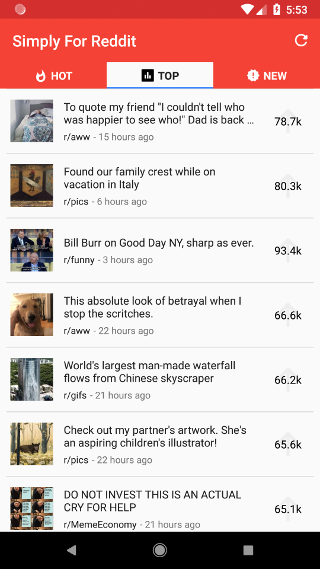
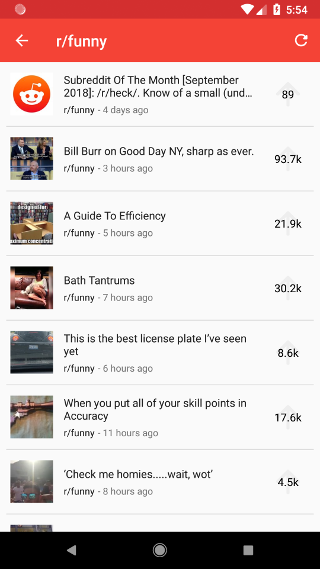
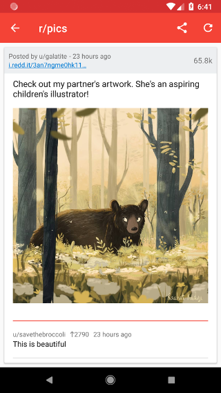
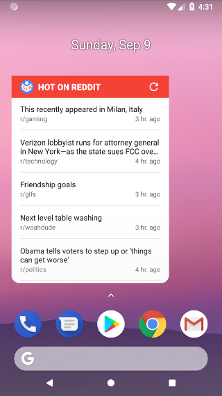

<h1>Simply For Reddit</h1>
A lightweight app with a simple UI for browsing Reddit. Show posts of a selected subreddit. Or display detailed information about a specific post, including images, GIFs and top comments.

*Final project for [Udacity's Android Developer Nanodegree Program](https://eu.udacity.com/course/android-developer-nanodegree-by-google--nd801) (built in partnership with Google).*

## Prerequisites
- The signing config will need to be removed from [build.gradle](app/build.gradle#L4) file as the source code is configured for publishing on the `Play Store`.
- Likewise, the app employs `Firebase Analytics`, which will need to be suppressed in [PostAdapter](app/src/main/java/com/andarb/simplyforreddit/adapters/PostAdapter.java#L33).

## Built with
- `Retrofit` and `RecyclerView` to download and display user content.
- [Paginate](https://github.com/MarkoMilos/Paginate) for paginating posts.
- `Glide` to download and display images/GIFs.
- `Room`, `ViewModel`, `LiveData` to retain user data in-between configuration changes and for offline viewing.
- Google AdMob for displaying an ad banner in the free flavour of the app.
- Firebase Analytics to record general app usage data as well as subreddits visited.
- `ViewPager` with custom tabs to separate different categories of posts.
- Rotate animation for refresh icon, and grow animation for share icon.

## Screen captures

Home screen|Subreddit sorting
-----------|-----------------
|

Post details and comments|Widget
-------------------------|-------
|

## Credits

[Reddit](https://www.reddit.com) - user content, and web API for accessing it.

## Licence
This project is licensed under the MIT Licence - see the [LICENCE](LICENCE) file for details.